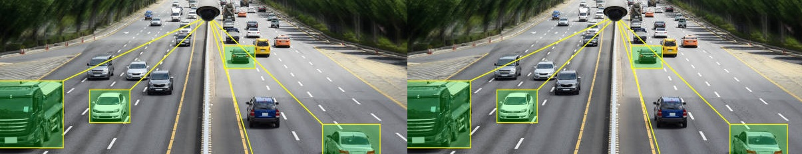

<!-- Reference:
https://github.com/othneildrew/Best-README-Template -->
<a name="readme-top"></a>


<!-- PROJECT LOGO -->
<br />
<div align="center">
  <h1><i> Street Specifications Generator <br> & Optimal Path Finder </i></h1>


  
  
  .

  <p align="center">
    An optimized encoding to solve vertex-cover problem !
  </p>
</div>

<br>

<!-- TABLE OF CONTENTS -->
<details>
  <summary>Table of Contents</summary>
  <ol>
    <li><a href="#about-the-project">About The Project</a></li>
    <li><a href="#built-with">Built With</a></li>
    <li><a href="#getting-started">Getting Started</a></li>
    <li><a href="#setup-and-use">Setup and Use</a></li>
    <li><a href="#license-or-author">License or Author</a></li>
    <li><a href="#contact">Contact</a></li>
    <li><a href="#acknowledgments">Acknowledgments</a></li>
  </ol>
</details>

<br>


<!-- ABOUT THE PROJECT -->
## About The Project
  * We have developed a street generation engine to create valid specifications in less than 10 unsuccessful attempts, which are later converted to graphs.
  * To bring the implemenatation to life, we dynamically generate trails for specifications & facilitate communication between processes using multiprogramming.

  <spacer height="10" width="10"></spacer>

  #### Ultimate Goal
  The project is aimed at solving a major problem associated with the installation of Security Cameras at traffic junctions. We optimize the vertex cover problem, to help the concerned authorities minimize the number of required cameras at different junctions, so as to attain maximum possible efficiency and coverage for monitoring.

    ##### Note:
    This project is used in conjunction with [Vertex-Cover-Optimizer](https://github.com/udityalaad/OptimizingVertexCoverProblem) to solve the utlimate problem (described above).

  <p align="right">(<a href="#readme-top">back to top</a>)</p>


## Built With
  &nbsp; &nbsp; &nbsp;   &nbsp; &nbsp; &nbsp; &nbsp; &nbsp; &nbsp;  &nbsp; &nbsp; &nbsp; &nbsp;  &nbsp; &nbsp; &nbsp; 

  &nbsp; &nbsp;  &nbsp; &nbsp; &nbsp; <b><i> Python </i></b> &nbsp; &nbsp; &nbsp; &nbsp; &nbsp; &nbsp; &nbsp; &nbsp; &nbsp; &nbsp; &nbsp; &nbsp; <b><i> C++ </i></b> &nbsp; &nbsp; &nbsp; &nbsp; &nbsp; &nbsp; &nbsp; &nbsp; &nbsp; &nbsp; &nbsp; &nbsp; &nbsp; <b><i> CMake </i></b> &nbsp; &nbsp; &nbsp; &nbsp; &nbsp; &nbsp; &nbsp; &nbsp; &nbsp; &nbsp; &nbsp; <b><i> Linux </i></b>

  <p align="right">(<a href="#readme-top">back to top</a>)</p>


<!-- GETTING STARTED -->
## Getting Started
  #### Prerequisites
  * Python, C++, CMake
  * Linux OS (Preferred - Ubuntu)
  * Machine Requirements: Minimum 4GB RAM, Intel i5 Processor (or Equivalent)

  <p align="right">(<a href="#readme-top">back to top</a>)</p>

  
## Setup and Use
  * The entire repo makes-up the source code for the project.
  * The main driver for the application is <b>'ece650-a3.cpp'.</b> Once ran, it invokes the following in parallel (concurrently):
    1. <b>Street Generator</b> (Can also be configured to provide custom Street Specifications).
    2. <b>Graph Generator:</b> Converts the set of street specifications to an undirected graph.
    3. <b>Shortest-Path Generator:</b> Finds shortest path from a user provided source to destination.
  * We use the above implementation in conjunction with [Vertex-Cover-Optimizer](https://github.com/udityalaad/OptimizingVertexCoverProblem); to provide the final solution for the problem statement (as a package).

  * ##### Build Commands
        cd /project
        mkdir build
        cd build
        cmake ../
        make install

  * ##### Automated Testing
        cd run/bin
        ../../tests_rgen
        python3 ../../../test_ece650-a1.py
        ../../tests_ece650-a3
        ../../tests_ece650-a2

  * ##### Run
      The input needs to be provided in the following format
      ```
        ./ece650-a3 -s ks -n kn -l kl -c kc
      ```
      
      where:
         <b>[1]</b>
        
      * ###### Sample Run with Default configuration
        ```
          ./ece650-a3
        ```

      * Once a Street Specification is generated by the application, simply provide an input in the form:
        ```
          s <src-node> <dest-node>
        ```

        And the application will generate the shortest path for you.

  #### Some interesting runs
    ./ece650-a3 -s 5 -n 4 -l 5
    ./ece650-a3 -s 5 -n 8 -l 5
    ./ece650-a3 -s 5 -n 11 -l 5 -c 2
    ./ece650-a3 -s 5 -n 4 -l 5 -c 1
    ./ece650-a3

  <p align="right">(<a href="#readme-top">back to top</a>)</p>


<!-- LICENSE -->
## License or Author
  * <b>Authored By</b> - Uditya Laad, Swapnil Baluja - University of Waterloo
  * <b>Initial Encoding</b> - &nbsp; Provided by Prof. Arie Gurfinkel, University of Waterloo, Waterloo, ON, CA

  <p align="right">(<a href="#readme-top">back to top</a>)</p>


<!-- CONTACT -->
## Contact
  <b>Uditya Laad</b> &nbsp; [@linkedin.com/in/uditya-laad-222680148](https://www.linkedin.com/in/uditya-laad-222680148/)
  
  &nbsp; &nbsp; &nbsp; &nbsp; &nbsp; &nbsp; &nbsp; &nbsp; &nbsp; &nbsp; &nbsp; [@github.com/udityalaad](https://github.com/udityalaad)
  
  &nbsp; &nbsp; &nbsp; &nbsp; &nbsp; &nbsp; &nbsp; &nbsp; &nbsp; &nbsp; &nbsp; udityalaad123@gmail.com

  <b>Project Link</b> &nbsp; [https://github.com/udityalaad/OptimizingVertexCoverProblem](https://github.com/udityalaad/OptimizingVertexCoverProblem)

  <p align="right">(<a href="#readme-top">back to top</a>)</p>


<!-- ACKNOWLEDGMENTS -->
## Acknowledgments
  * Author, Prof. Arie Gurfinkel., University of Waterloo, Waterloo: ECE 650 Project - uw-ece650-1221-prj.pdf (2022)
  * Author, Prof. Arie Gurfinkel., University of Waterloo, Waterloo: ECE 650 Assignment 4 - uw-ece650-1221-a4.pdf (2022)
  * Owner, Prof. Arie Gurfinkel., University of Waterloo: graphGen
  * [GNU Plot Home Page](http://gnuplot.sourceforge.net.)
  * [Minisat Home Page](http://minisat.se/.)
  * [Vertex Cover, Wikipedia](https://en.wikipedia.org/wiki/Vertex_cover)
  
  <p align="right">(<a href="#readme-top">back to top</a>)</p>
